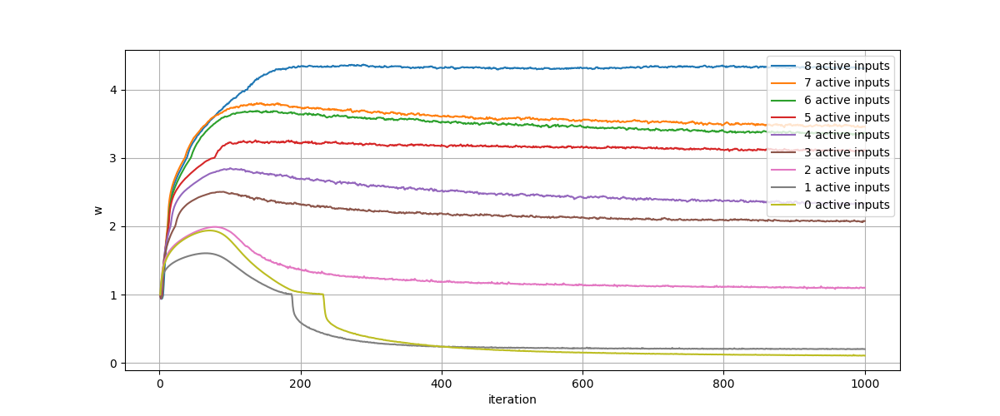
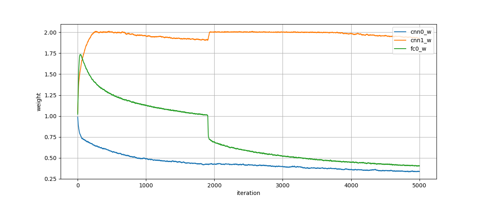

# Going Deeper: Infinite Deep Neural Networks

This repository contains the code for the experiments of the following paper-like document:
[doc/going_deeper.pdf](doc/going_deeper.pdf)

## Summary

The document descirbes a meta-layer for infinite deep neural networks. It basically wraps a few other layers in a special way that allows the neural network to decide how many sub-layers in the meta-layer should be used. Each sub-layer has its own weights and, therefore, the networks also decides how many weights should be used. The complete training processe may be done with gradient descent based methods.

Please read [doc/going_deeper.pdf](doc/going_deeper.pdf) for more details.

## Library

The repository contains a small library that allows to use the described meta-layer. The library is based on [Keras](https://keras.io/). The library is very minimal and, therefore, not all network architectures may be created with it. A basic model (the model of the first experiment), may be created like this:

	# Create the model
	n_input_units = 8
	n_internal_units = 24
	model = TDModel()
	model += Input((n_input_units,))
	model += Dense(n_internal_units, activation='relu', trainable=False)
	
	# The described meta-layer
	model += GInftlyLayer(
	
		# The name
	    'd0',
	
		# f_i(x)
	    f_layer=[
	        lambda reg: Dense(n_internal_units),
	        lambda reg: GammaRegularizedBatchNorm(reg=reg, max_free_gamma=0.),
	        lambda reg: Dropout(0.1),
	    ],
	
		# h(x)
		h_step=[
	        lambda reg: Activation('relu')
	    ],
	
		# Regularizers
	    w_regularizer=(c_l2, w_reg),
	    f_regularizer=(c_l2, f_reg)#1e-2)
	)
	model += Dense(1, activation='sigmoid', trainable=False)
	
	
	# Build the model
	model.init(
	    optimizer='adam',
	    loss='binary_crossentropy',
	    metrics=['accuracy']
	)

You may try to test the first experiment to get a better feeling for the interface.

## Experiments

All experiments are more detailed documented in [doc/going_deeper.pdf](doc/going_deeper.pdf).

The first experiment uses 8 binary inputs and calculates the XOR-result of them. The used netwok contains only trainable weights in a `GInftyLayer`-layer. Tests are done with 0-8 active inputs for the XOR-calculation. Inactive inputs are not used for the XOR-calculation and just get random input values.

It can be assumed that a network with more active inputs for the XOR-computation is more complex and, therefore, requires more sub-layers in the `GInftyLayer`-layer. Exactly this can be shown with the given experiment. The `w`-value, which basically contains the amount of sub-layers is higher for more active inputs:

The second experiment is conducted on the MNIST-dataset. The used network architecture contains two convolutional `GInftyLayer`-layers and one fully connected `GInftyLayer`-layer. The test accuracy is up to 99.5 % and it can be seen that the second convolutional `GInftyLayer`-layer is the deepest layer. The first convolutional and the  fully connected `GInftyLayer`-layer have a very low activation. The second convolutional layer has a depth of 2. The weights are visualized on the following plot:

